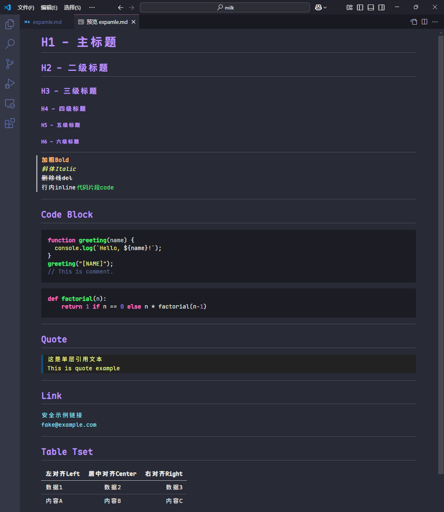

# vsc_md_preview_theme

VSCode Markdown Preview Dracula Theme



## How to use

Search **Markdown:Styles** in setting, add `https://cdn.jsdelivr.net/gh/xrunes/vsc_md_preview_theme/style.css`.

Or modify **setting.json**, add

```json
"markdown.styles": [
        "https://cdn.jsdelivr.net/gh/xrunes/vsc_md_preview_theme/style.css"
    ],
```

## Network in Chia

如果你在中国，jsdelivr可能会被屏蔽，可以使用[镜像](https://cdn.jsdmirror.com/)代替，例如`https://cdn.jsdmirror.cn/gh/xrunes/vsc_md_preview_theme/style.css`

镜像站作者的[博客](https://www.codeqihan.com/post/zi-zhi-de-yi-ge-jsdelivr-jing-xiang-fen-xiang/)

## BUGs / 目前存在的问题

Currently, this CSS is only recommended for use the dark VSCode theme. Because in light themes, VSCode will automatically change elements such as fonts, scroll bars, and underlines to black. This CSS also has a dark background, which is extremely difficult to recognize. Therefore, it is not recommended. I am currently thinking of a solution.

目前仅推荐在深色（暗色）VSCode主题下使用本CSS。因为在浅色（亮色）主题下，VSCode会自动将字体、滚动条、下划线等元素改成黑色，本CSS也是暗色背景，极难辨认，故不推荐，正在想解决方法。

## Attention

- **markdown.styles** only support positive path, DO NOT support absolute path. This is why I use online URL.
- Eferencing style.css through `https://raw.githubusercontent.com/xrunes/vsc_md_preview_theme/refs/heads/master/style.css` DO NOT work either. It seems Github don't support [https://github.com/microsoft/vscode/issues/8287#issuecomment-230021773](https://github.com/microsoft/vscode/issues/8287#issuecomment-230021773)
